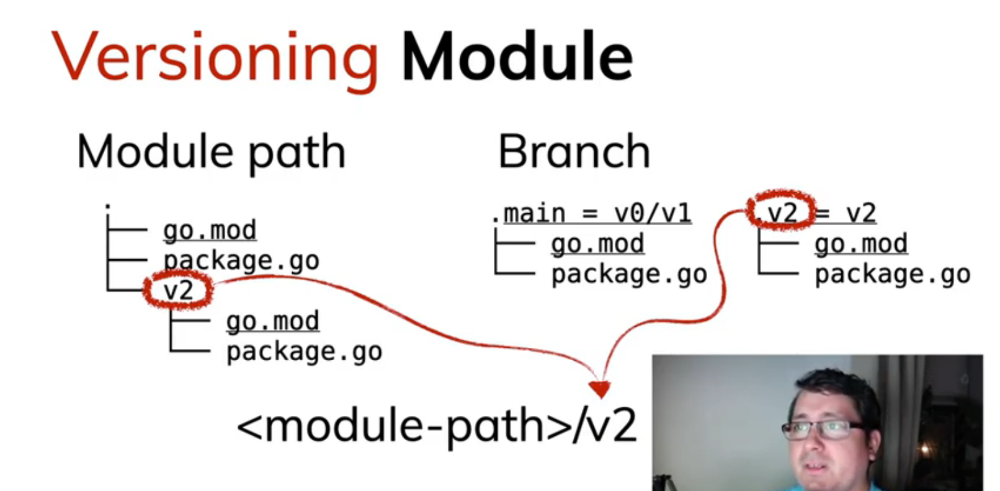

## What is a Module ?

is a collection of Go packgages stored in a file tree git a `go.mod` file at its root.

### go.mod

- module <name>
- go <version>
- require <module-path><version> // your dependencies; indirect means that another packge on your package depend on this package not directly imported on your project
- replace <module-path><version> // take requirements that you have -> replace with something that you have
- exlude <module-path><version>

### go.sum

Checksum to install sepecify version, insure security

## Versioning Module

## Commands

- go mod tidy: add or remove dependencies if they're referenced or not referenced in the project
- go mod why <name>: check if the package is needed
- go clean -cache -modcache -i -r
- go liest -m -versions <name>
